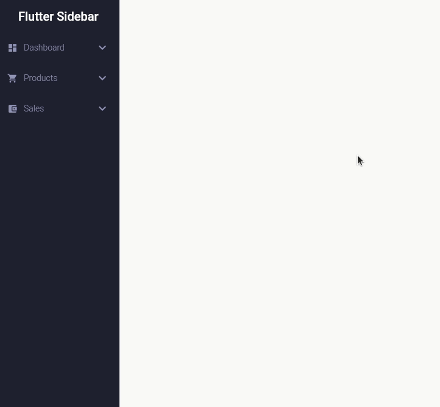

## FLUTTER SIDEBAR

   

## Descrição do Projeto

Flutter Web - Criando uma sidebar com o widget ExpansionTile!

<h4 align="center"> 
	🚧  EM DESENVOLVIMENTO  🚧
</h4>

  

Tecnologias

-  [Flutter](https://flutter.dev/)
-  [Dart](https://dart.dev/)
-  [VS code](https://code.visualstudio.com/)

-  [Android Studio](https://developer.android.com/studio)

Feito com ♥ por Ricardo Monteiro  [Entrar em contato!](https://www.linkedin.com/in/ricardohmonteiro/)